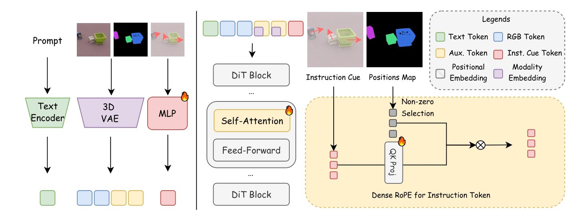
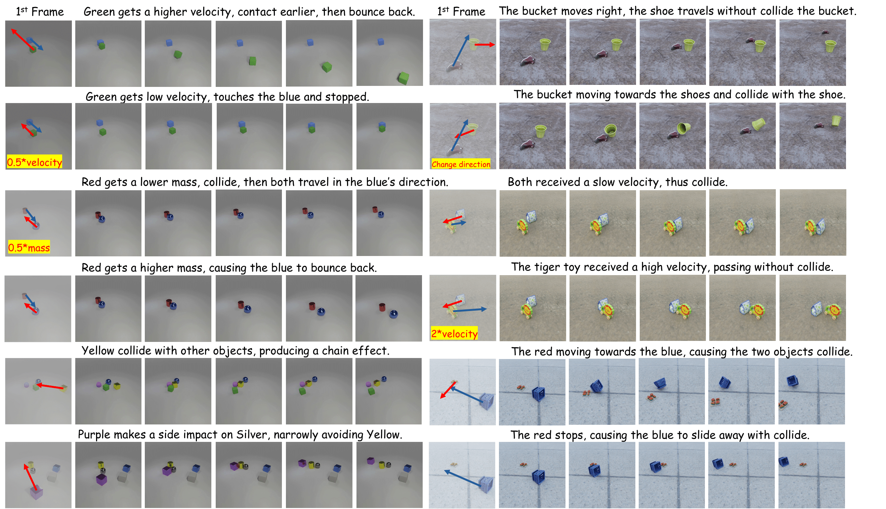

# STANCE: Motion-Coherent Video Generation via Sparse-to-Dense Anchored Encoding

[ZhiFei Chen](https://zhifeichen097.github.io/), [Tianshuo Xu](https://scholar.google.com/citations?user=I6_dXvEAAAAJ&hl=zh-CN), [Leyi Wu](https://yuevii.github.io/), [Luozhou Wang](https://wileewang.github.io/), [Dongyu Yan](http://me.starydy.xyz/), [Zihan You](), [Wenting Luo](), [Guo Zhang](), [Yingcong Chen](https://www.yingcong.me)<sup>†</sup>


<a href="https://envision-research.github.io/STANCE/"></a>
<a href="https://arxiv.org/abs/2510.14588"></a> 
<a href="#"></a>
<a href="#"></a>

---

## 🎏 Introduction

**STANCE** is a controllable image-to-video framework that keeps motion consistent while preserving appearance. 

* **Problem.** Purely visual video diffusion looks great but drifts or “hovers” near contacts, and sparse control maps get washed out after encoding.
* **Key idea.** Turn masks/arrows (+ optional depth, mass) into dense 2.5D instance cues; keep them salient with **Dense RoPE** and stabilize with a joint RGB + structural head.
* **Result.** Contact-aware, drift-resistant motion with faithful direction/speed/mass—without per-frame trajectories.

<details>
<summary>CLICK for the full abstract-style summary</summary>
  
Video generation has recently made striking visual progress, but maintaining coherent object motion and interactions remains difficult. We trace two practical bottlenecks: (i) human-provided motion hints (e.g., small 2D maps) often collapse to too few effective tokens after encoding, weakening guidance; and (ii) optimizing for appearance and motion in a single head can favor texture over temporal consistency. We present STANCE, an image-to-video framework that addresses both issues with two simple components.
  
First, we introduce Instance Cues—a pixel-aligned control signal that turns sparse, user-editable hints into a dense 2.5D (camera-relative) motion field by averaging per-instance flow and augmenting with monocular depth over the instance mask. This reduces depth ambiguity compared to 2D drag/arrow inputs while remaining easy to user. Second, we preserve the salience of these cues in token space with Dense RoPE, which tags a small set of motion tokens (anchored on the first frame) with spatial-addressable rotary embeddings. Paired with joint RGB + auxiliary-map prediction (segmentation or depth), our model anchors structure while RGB handles appearance, stabilizing optimization and improving temporal coherence without requiring per-frame trajectory scripts.
</details>

---

## 💡 Method at a glance

<p align="center">
  
  <br/><em>Overall Architecture</em>
</p>

**Instance Cues (Sparse → Dense, 2.5D).** From per-instance arrows + masks (+ optional depth delta), we rasterize a **dense in-mask vector field** and append a **scalar ∆z** channel (camera-relative), disambiguating out-of-plane intent under camera motion. Training uses per-instance averaged flow (+ monocular depth) to match the test-time cue format.

**Dense RoPE (Token-dense, spatially addressable control).** Downsampling makes low-res control maps too sparse. We **extract non-zero sites**, enforce a **fixed motion-token budget**, and **tag them with first-frame RoPE** so their spatial identity persists over time—keeping control strong post-encoding.

**Joint Auxiliary Generation (RGB + Depth/Seg).** We duplicate the video token stream so the model predicts both RGB and a structural map under the **same** cues/positions; a tiny domain tag distinguishes modalities. This anchors geometry and reduces drift while RGB handles appearance.

---

## 🎮 What can STANCE edit?

* **Speed & direction sweeps:** Increasing |v₀| yields longer travel and earlier contact; rotating the arrow rotates the trajectory while preserving appearance.
* **Mass sweeps:** Changing mass flips post-contact outcomes (e.g., light object deflects vs. heavy object pushes through).
* **Real-world tabletop demos:** Identity-preserving motion and plausible chain reactions from a phone-captured keyframe.

<p align="center">
  
  <br/>
  
</p>

---

## ⚙️ Installation

We recommend **Python ≥ 3.9**, **PyTorch ≥ 2.3** with CUDA 12.x.

```bash
# 1) create env
conda create -n stance python=3.9 -y
conda activate stance

# 2) install torch (pick your CUDA build)
pip install --index-url https://download.pytorch.org/whl/cu121 torch torchvision torchaudio

# 3) essentials
pip install -r requirements.txt

# 4) (optional) segmentation for masks — SAM / SAM2
pip install git+https://github.com/facebookresearch/segment-anything.git
# or:
# pip install git+https://github.com/facebookresearch/sam2.git
```

### Model weights (required)

STANCE is **based on CogVideoX** and uses a **depth estimator** for cues.
Please download the following **before** running training/inference, and place them in the Hugging Face caches as shown below:

* **CogVideoX 1.5 (5B) – Image-to-Video** weights: `THUDM/CogVideoX1.5-5B-I2V`
* **Depth Anything V2 – Large** weights: `depth-anything/Depth-Anything-V2-Large`

#### Put weights under the Hugging Face caches

Hugging Face uses `~/.cache/huggingface/hub` by default. Some environments also read `~/.cache/huggingface/`. You can mirror via symlink or copy.

```bash
# set HF cache (optional)
export HF_HOME="$HOME/.cache/huggingface"

# pre-download & cache (requires git-lfs or HF CLI)
pip install -U "huggingface_hub[cli]" git-lfs
git lfs install

# CogVideoX 1.5 I2V
huggingface-cli download THUDM/CogVideoX1.5-5B-I2V \
  --local-dir "$HF_HOME/hub/models--THUDM--CogVideoX1.5-5B-I2V"

# Depth Anything V2 (Large)
huggingface-cli download depth-anything/Depth-Anything-V2-Large \
  --local-dir "$HF_HOME/hub/models--depth-anything--Depth-Anything-V2-Large"

# (optional) mirror the hub directory to the parent cache for legacy code paths
ln -sfn "$HF_HOME/hub" "$HF_HOME/models"
```

> **Backbone.** We fine-tune a **CogVideoX-1.5 (5B) image-to-video** backbone; default generation is **512×512, 49 frames @ 16 FPS**.

---

## 📦 Data

We provide Kubric rendering scripts (to be released) covering rigid-interaction clips across (i) simple multi-object collisions and (ii) composite realistic scenes. We randomize object shape, mass, initial velocity, placement/pose, and backgrounds; we keep camera intrinsics/extrinsics consistent within a scene. Please refer to the dataset download page above.

**Post-download step.** After downloading, run the script below (update the dataset path inside the script as needed) to generate the valid video paths for training:

```bash
python /hpc2hdd/home/zchen379/sd3/STANCE/finetune/find_video.py
```

---

## 💫 Training & Inference

```bash
# Training
bash YOUR/OWN/PATH/STANCE/finetune/train_stance.sh

# Inference
bash YOUR/OWN/PATH/STANCE/finetune/infer_stance.sh
```

> Replace `YOUR/OWN/PATH` with your actual absolute path (e.g., `/hpc2hdd/home/zchen379/sd3`). Ensure the scripts are executable:
>
> ```bash
> chmod +x YOUR/OWN/PATH/STANCE/finetune/train_stance.sh
> chmod +x YOUR/OWN/PATH/STANCE/finetune/infer_stance.sh
> ```

---

## 🚩 Features / Roadmap

* [✅] Code release (training & inference)
* [✅] Kubric dataset & generation scripts
* [] Pretrained checkpoints (Dense RoPE; RGB+Depth / RGB+Seg)
* [] Gradio Demo for better usage

---

## 📄 BibTeX

> Update after arXiv goes live

```bibtex
@article{chen2025stance,
      title={STANCE: Motion Coherent Video Generation Via Sparse-to-Dense Anchored Encoding}, 
      author={Zhifei Chen and Tianshuo Xu and Leyi Wu and Luozhou Wang and Dongyu Yan and Zihan You and Wenting Luo and Guo Zhang and Yingcong Chen},
      journal={arXiv preprint arXiv:2510.14588},
      year={2025},

}
```
