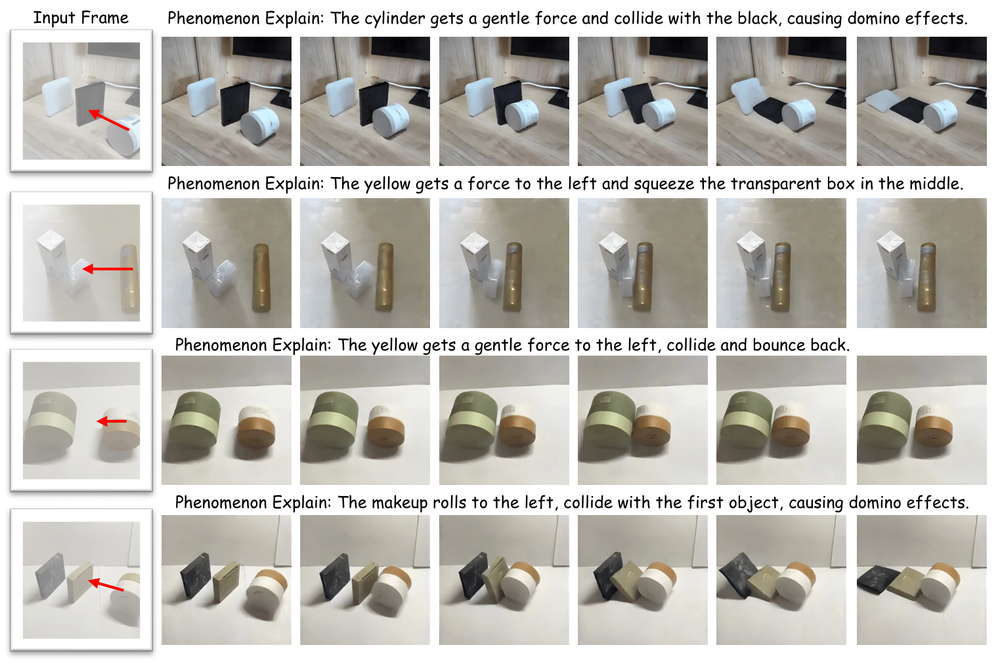

# STANCE: Motion-Coherent Video Generation via Sparse-to-Dense Anchored Encoding

[ZhiFei Chen]()<sup>*</sup>, [Tianshuo Xu]()<sup>*</sup>, [Leyi Wu]()<sup>*</sup>, [Luozhou Wang](), [Dongyu Yan](), [Zihan You](), [Wenting Luo](), [Guo Zhang](), [Yingcong Chen](https://www.yingcong.me)<sup>†</sup>

HKUST(GZ) · HKUST · XMU · MIT

<sup>*</sup> Equal contribution.  <sup>†</sup> Corresponding author.

<a href="#"></a> <a href="#"></a> <a href="#"></a> <a href="#"></a>

---

<p align="center">
  
</p>

## 🎏 Introduction

**STANCE** is a controllable image-to-video framework that keeps motion consistent while preserving appearance. Users provide a keyframe plus **instance masks**, **coarse 2D arrows** (direction/speed), an optional **depth delta** (2.5D), and **per-instance mass**. We convert these sparse hints into **dense, pixel-aligned motion cues** and inject them with **Dense RoPE** tokens so the control remains strong after tokenization. We also **jointly predict RGB + a lightweight structural map** (depth or segmentation) to stabilize temporal coherence.

<details>
<summary>CLICK for the full abstract-style summary</summary>

* **Problem.** Purely visual video diffusion looks great but often drifts or “hovers” near contacts; sparse control maps get washed out after encoding.
* **Key idea.** Turn human-editable hints into a **dense, 2.5D instance cue** per object; keep those cues salient in token space via **Dense RoPE** (spatially addressable motion tokens anchored on the first frame). Train RGB **with** an auxiliary structural head to act as a geometry/consistency witness.
* **Result.** Better direction/speed/mass faithfulness, cleaner contact onsets, and less drift—without frame-by-frame trajectories.

</details>

---

## 💡 Method at a glance

<p align="center">
  
  <br/><em>Overall Architecture</em>
</p>

**Instance Cues (Sparse → Dense, 2.5D).** From per-instance arrows + masks (+ optional depth delta), we rasterize a **dense in-mask vector field** and append a **scalar ∆z** channel (camera-relative), disambiguating out-of-plane intent under camera motion. Training uses per-instance averaged flow (+ monocular depth) to match the test-time cue format.

**Dense RoPE (Token-dense, spatially addressable control).** Downsampling makes low-res control maps too sparse. We **extract non-zero sites**, enforce a **fixed motion-token budget**, and **tag them with first-frame RoPE** so their spatial identity persists over time—keeping control strong post-encoding.

**Joint Auxiliary Generation (RGB + Depth/Seg).** We duplicate the video token stream so the model predicts both RGB and a structural map under the **same** cues/positions; a tiny domain tag distinguishes modalities. This anchors geometry and reduces drift while RGB handles appearance.

---

## 🎮 What can STANCE edit?

* **Speed & direction sweeps:** Increasing |v₀| yields longer travel and earlier contact; rotating the arrow rotates the trajectory while preserving appearance.
* **Mass sweeps:** Changing mass flips post-contact outcomes (e.g., light object deflects vs. heavy object pushes through).
* **Real-world tabletop demos:** Identity-preserving motion and plausible chain reactions from a phone-captured keyframe.

<p align="center">
  
  <br/>
  
</p>

---

## ⚙️ Installation

We recommend **Python ≥ 3.9**, **PyTorch ≥ 2.3** with CUDA 12.x.

```bash
# 1) create env
conda create -n stance python=3.9 -y
conda activate stance

# 2) install torch (pick your CUDA build)
pip install --index-url https://download.pytorch.org/whl/cu121 torch torchvision torchaudio

# 3) essentials
pip install -r requirements.txt

# 4) (optional) segmentation for masks — SAM / SAM2
pip install git+https://github.com/facebookresearch/segment-anything.git
# or:
# pip install git+https://github.com/facebookresearch/sam2.git
```

### Model weights (required)

STANCE is **based on CogVideoX** and uses a **depth estimator** for cues.
Please download the following **before** running training/inference, and place them in the Hugging Face caches as shown below:

* **CogVideoX 1.5 (5B) – Image-to-Video** weights: `THUDM/CogVideoX1.5-5B-I2V`
* **Depth Anything V2 – Large** weights: `depth-anything/Depth-Anything-V2-Large`

#### Put weights under the Hugging Face caches

Hugging Face uses `~/.cache/huggingface/hub` by default. Some environments also read `~/.cache/huggingface/`. You can mirror via symlink or copy.

```bash
# set HF cache (optional)
export HF_HOME="$HOME/.cache/huggingface"

# pre-download & cache (requires git-lfs or HF CLI)
pip install -U "huggingface_hub[cli]" git-lfs
git lfs install

# CogVideoX 1.5 I2V
huggingface-cli download THUDM/CogVideoX1.5-5B-I2V \
  --local-dir "$HF_HOME/hub/models--THUDM--CogVideoX1.5-5B-I2V"

# Depth Anything V2 (Large)
huggingface-cli download depth-anything/Depth-Anything-V2-Large \
  --local-dir "$HF_HOME/hub/models--depth-anything--Depth-Anything-V2-Large"

# (optional) mirror the hub directory to the parent cache for legacy code paths
ln -sfn "$HF_HOME/hub" "$HF_HOME/models"
```

#### Load locally (no network)

```python
from diffusers import CogVideoXImageToVideoPipeline
from transformers import AutoModelForDepthEstimation, AutoImageProcessor

# CogVideoX backbone (diffusers)
pipe = CogVideoXImageToVideoPipeline.from_pretrained(
    "THUDM/CogVideoX1.5-5B-I2V", local_files_only=True
)

# Depth Anything V2 (transformers)
proc = AutoImageProcessor.from_pretrained(
    "depth-anything/Depth-Anything-V2-Large", local_files_only=True
)
depth_model = AutoModelForDepthEstimation.from_pretrained(
    "depth-anything/Depth-Anything-V2-Large", local_files_only=True
)
```

> **Backbone.** We fine-tune a **CogVideoX-1.5 (5B) image-to-video** backbone; default generation is **512×512, 49 frames @ 16 FPS**.

---

## 📦 Data

We provide Kubric rendering scripts (to be released) covering rigid-interaction clips across (i) simple multi-object collisions and (ii) composite realistic scenes. We randomize object shape, mass, initial velocity, placement/pose, and backgrounds; we keep camera intrinsics/extrinsics consistent within a scene. Please refer to the dataset download page above.

**Post-download step.** After downloading, run the script below (update the dataset path inside the script as needed) to generate the valid video paths for training:

```bash
python /hpc2hdd/home/zchen379/sd3/STANCE/finetune/find_video.py
```

---

## 💫 Training & Inference

```bash
# Training
bash YOUR/OWN/PATH/STANCE/finetune/train_stance.sh

# Inference
bash YOUR/OWN/PATH/STANCE/finetune/infer_stance.sh
```

> Replace `YOUR/OWN/PATH` with your actual absolute path (e.g., `/hpc2hdd/home/zchen379/sd3`). Ensure the scripts are executable:
>
> ```bash
> chmod +x YOUR/OWN/PATH/STANCE/finetune/train_stance.sh
> chmod +x YOUR/OWN/PATH/STANCE/finetune/infer_stance.sh
> ```

---

## 🚩 Features / Roadmap

* [✅] Code release (training & inference)
* [✅] Kubric dataset & generation scripts
* [ ] Pretrained checkpoints (Dense RoPE; RGB+Depth / RGB+Seg)
* [ ] Gradio Demo for better usage

---

## 📄 BibTeX

> Update after arXiv goes live

```bibtex
@inproceedings{STANCE2026,
  title     = {STANCE: Motion-Coherent Video Generation via Sparse-to-Dense Anchored Encoding},
  author    = {TBD},
  booktitle = {ICLR},
  year      = {2026}
}
```
